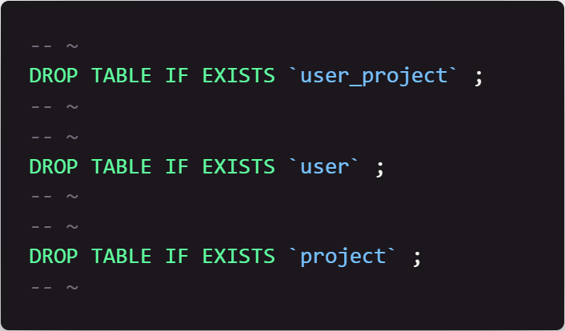
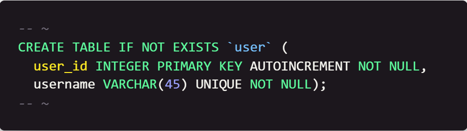
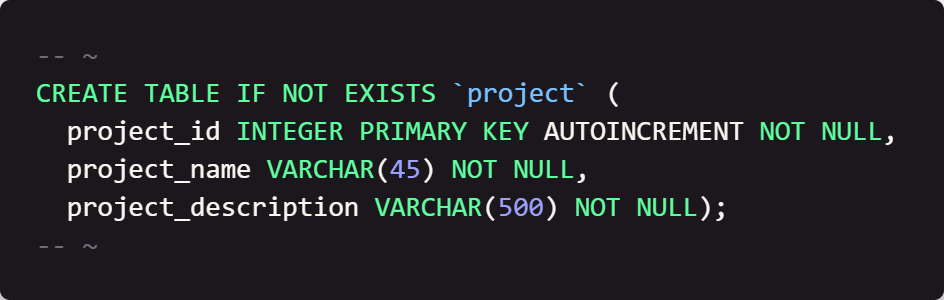
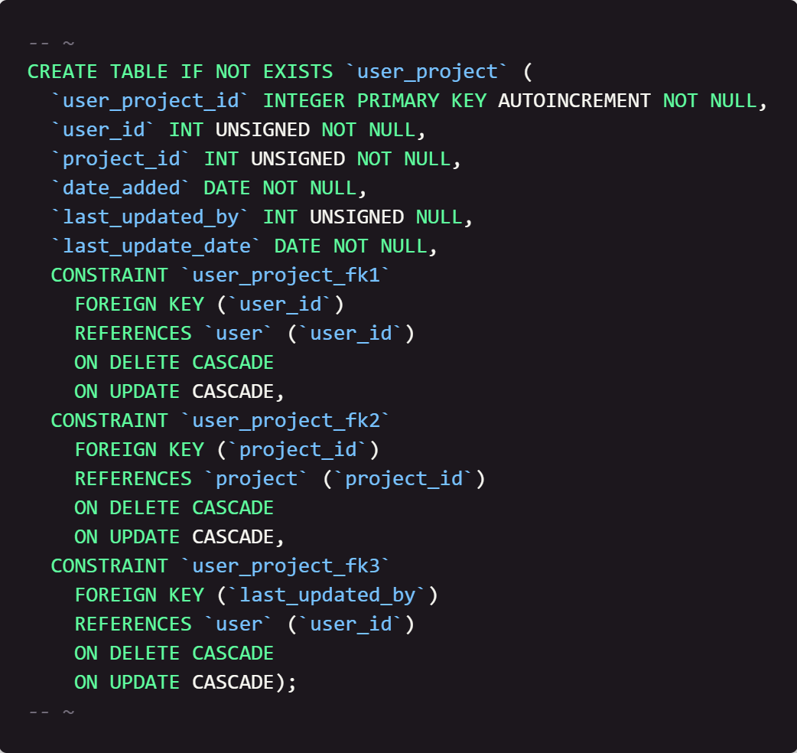

# Database Setup

## Table of Contents

- [Home](../README.md)

## Introduction

This week we are going to create the database we will use for our project. We are going to simply code the database from within VS Code. Please note that there are specific comments that surround the code (e.g. '-- ~'). This is important as our code will use these comments to run each statement. Please code these in as well.

#### Focus: The `user`, `project`, and `user_project` table creation in SQL. 

## Instructions

1. Create a new file called `create_db.sql`.

2. First. We need to make sure the tables don't exist in the database. Type the following code into the file:

    

    This code will drop the tables if they already exist. This is useful if you need to recreate the database.

3. Next we are going to create the tables. Type the following code in the file:

    

    This code will create the `user` table. The `user_id` column is the primary key and will autoincrement. The `username` column is a VARCHAR that is unique and cannot be NULL.

    

    This code will create the `project` table. The `project_id` column is the primary key and will autoincrement. The `project_name` and `project_description` columns are VARCHARs that cannot be NULL.

    

    This code will create the `user_project` table. The `user_project_id` column is the primary key and will autoincrement. The `user_id` and `project_id` columns are Foreign keys that reference the `user` and `project` tables respectively. The `date_added` and `last_update_date` columns are DATE data types that will help us know when the project was added and last updated. The `last_updated_by` column is a Foreign key that references the `user` table and will reference who last touched that project.

4. Save the file.

## Next Steps

[Week 2](../week2/README.md) - In week 2, we will start creating some python code that will allow us to insert data into the tables we have created. We will also create some python code that will allow us to query the data that we have inserted into the tables.