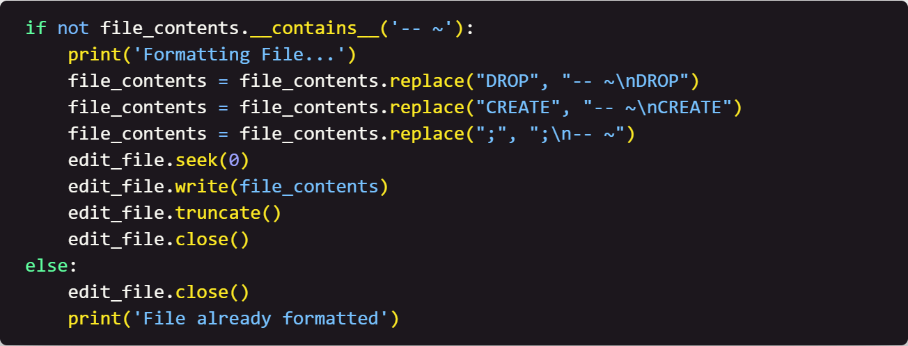

# Week 2: Using Python to Create the Database

## Table of Contents

- [Home](../README.md)
- [Week 1](../week1/README.md)

## Introduction

This week we are going to start creating some python code that will allow us to create the database.

#### Focus: The `create_database` file.

## Instructions

1. Create a new file called `create_database.py`.

2. First, we need to define the library we need and create a class. Write the following code: 

    <!-- Image of code here -->
    

    This will import the `sqlite3` library and set up a `create` class that will allow us to define the functions we will use for the `create` table.

3. Next, we need to define the `__init__` function. Write the following code:

    <!-- Image of code here -->
    

    This code will set up the connection to the database and create a cursor object that will allow us to interact with the database. This is also the way we set up default settings for the class.

4. Next, we need to define the `create_db` function. Write the following code:

    <!-- Image of code here -->
    

    This code will begin to define the create_db function.

5. Next, we need to define an if else block. Write the following code:

    <!-- Image of code here -->
    

    This code will check to see if the create_db.sql file has the comment delimiters. If it does then it continues on, if not, it will add the comment delimiter (e.g. '-- ~').

6. Next, we need to parse the SQL file. Write the following code:

    <!-- Image of code here -->
    

    This code will parse the SQL file and return a list of SQL statements.

7. Next, we need to execute the SQL statements. Write the following code:
    
    <!-- Image of code here -->
    

    This code will execute the SQL statements that were parsed from the SQL file or return an error if there is one.

8. Next, we need to check the number of drop and create statements. Write the following code outside the `for` loop:

    <!-- Image of code here -->
    

    This code will check the number of drop and create statements in the SQL file.

9. Next, we need to check for an exception for the whole process. Write the following code:

    <!-- Image of code here -->
    

    This code will check for an exception for the whole process.
10. Save the file.

## Next Steps

[Week 3](../week3/README.md) - In week 3, we will write python code that will allow us to insert data into the `user` table. 
