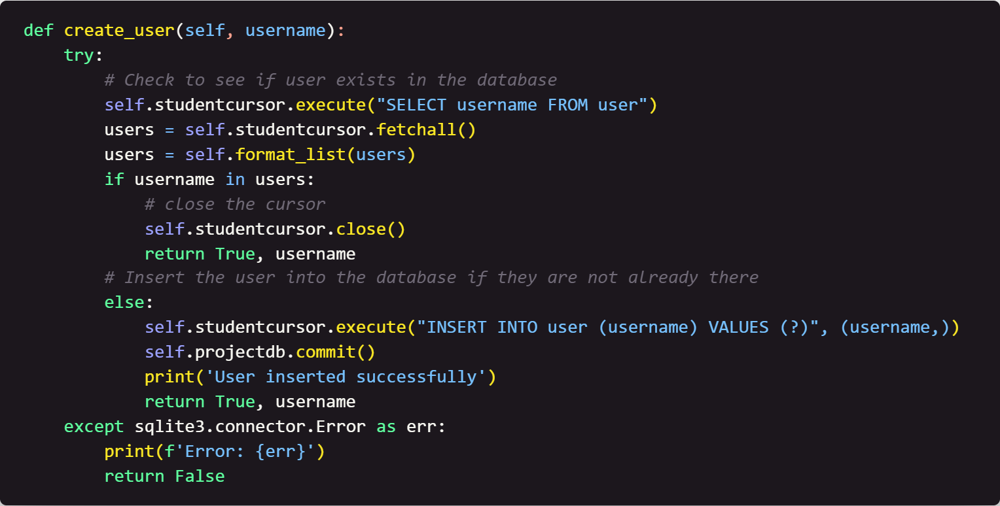

# Week 3: Using Python to Insert Data into the `user` Table

## Table of Contents

- [Home](../README.md)
- [Week 1](../week1/README.md)
- [Week 2](../week2/README.md)

## Introduction

This week we are going to start creating some python code that will allow us to insert data into the tables we have created. 

#### Focus: The `user` table.

## Instructions

1. Create a new file called `check_user.py`.

2. First, we need to define the library we need and create a class. Write the following code: 

    <!-- Image of code here -->
    

    This will import the `sqlite3` library and set up a `user` class that will allow us to define the functions we will use for the `user` table.

3. Next, we need to define the `__init__` function. Write the following code:

    <!-- Image of code here -->
    

    This code will set up the connection to the database and create a cursor object that will allow us to interact with the database. This is also the way we set up default settings for the class.

4. Next, we need to define the `format_list` function. Write the following code:

    <!-- Image of code here -->
    

    This code will take a list of values and return a string that can be used in an SQL statement.

5. Next, we need to define the `create_user` function. Write the following code:

    <!-- Image of code here -->
    

    This code will check to see if the user exists and if not, insert the user into the database.

6. Save the file.

## Next Steps

[Week 4](../week4/README.md) - In week 4, we will write python code that will allow us to insert data into the `project` table. 