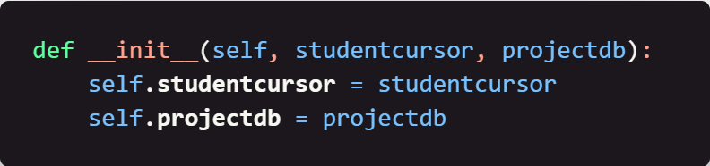
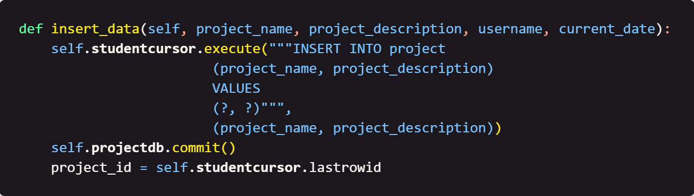
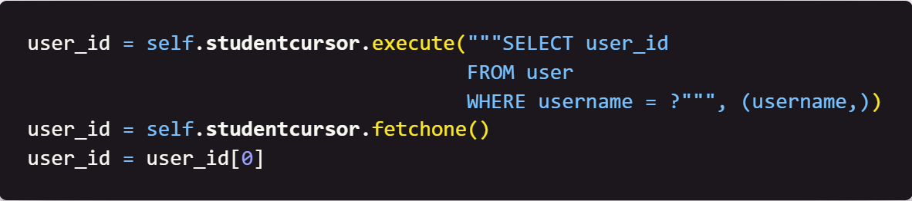
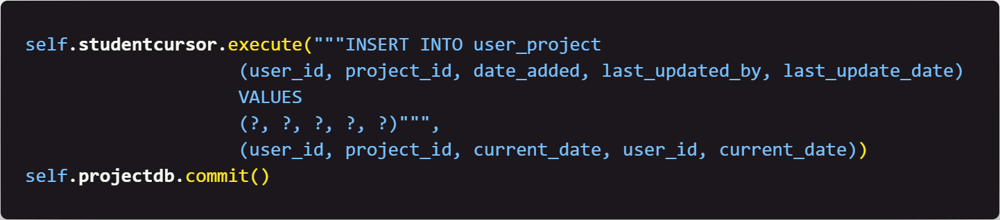

### Week 4: Inserting Data into the `project` and `user_project` Tables

## Table of Contents

- [Home](../README.md)
- [Week 1](../week1/README.md)
- [Week 2](../week2/README.md)
- [Week 3](../week3/README.md)

## Introduction

In week 4, we will write python code that will allow us to insert data into the `project` and `user_project` tables.  
Note: The `?` in the SQL statements are placeholders for the data that will be inserted into the tables.

#### Focus: The `project` and `user_project` tables.

#### Instructions
1. Create a new python file called `insert_project_data.py`.

2. Initialize the `insert` class with the following code:

    

    This code will set up an `insert` class that will allow us to define the functions we will use to insert data into the `project` and `user_project` tables.

3. Define the `__init__` function with the following code:

    

    This code will set up the connection to the database and create a cursor object that will allow us to interact with the database. This is also the way we set up default settings for the class.

4. Define the `insert_data` function with the following code:

    

    This code will begin to define the `insert_data` function. This function will grab the id of the latest added project for use in the `user_project` table. This function also uses the current date and time for the `last_update_date` and `date_added` fields in the `user_project` table which will be shown in step 6.

5. Continuing in the `insert_data` function, write the following code:

    

    This code will grab the user id from the `user` table.

6. Continuing in the `insert_data` function, write the following code:

    

    This code will insert the data into the `user_project` table, utilizing the ids from the `user` and `project` tables.

## Next Steps

[Week 5](../week5/README.md) - In week 5, we will write python code that will allow us to update our project data.
