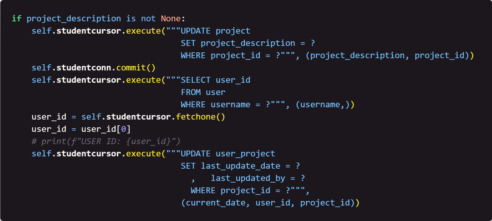

### Week 5: Updating Project Data 

## Table of Contents

- [Home](../README.md)
- [Week 1](../week1/README.md)
- [Week 2](../week2/README.md)
- [Week 3](../week3/README.md)
- [Week 4](../week4/README.md)

## Introduction

In week 5, we will write python code that will allow us to update our project data.

#### Focus: The `project` and `user_project` tables.

## Instructions

1. Create a new python file called `update_project_data.py`.

2. Initialize the `update` class with the following code:

    

    This code will set up an `update` class that will allow us to define the functions we will use to update data in the `project` table.

3. Define the `__init__` function with the following code:

    

    This code will set up the connection to the database and create a cursor object that will allow us to interact with the database. This is also the way we set up default settings for the class.

4. Define the `update_data` function with the following code:
    
    

    This code will update the `project` table with the new data that is passed in.

5. Create the if statement to check if the `new_project_name` is not None:
        
    
    
    This code will check to see if the `new_project_name` is not None and if it is not, update the project name in the `project` table.

6. Create the if statement to check if the `project_description` is not None:
        
    

    This code will check to see if the `project_description` is not None and if it is not, update the project description in the `project` table.

7. Save the file.

## Next Steps

[Week 6](../week6/README.md) - In week 6, we will write python code that will allow us to delete data from the `project` table.