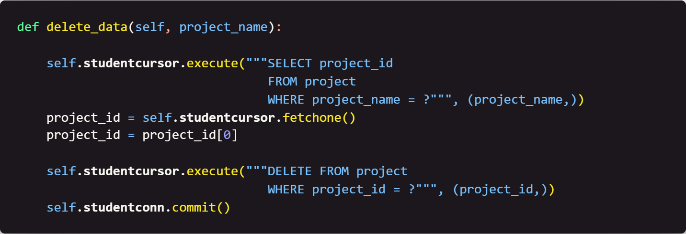

# Week 6: Deleting Data from the project Table

## Table of Contents

- [Home](../README.md)
- [Week 1](../week1/README.md)
- [Week 2](../week2/README.md)
- [Week 3](../week3/README.md)
- [Week 4](../week4/README.md)
- [Week 5](../week5/README.md)

## Introduction

This week we are going to write python code that will allow us to delete data from the `project` table.

#### Focus: The `project` table.

## Instructions

1. Create a new file called `delete_project_data.py`.

2. First, we need to define the library we need and create a class. Write the following code: 

    <!-- Image of code here -->
    

    This will import the `sqlite3` library and set up a `user` class that will allow us to define the functions we will use for the `user` table.

3. Next, we need to define the `__init__` function. Write the following code:

    <!-- Image of code here -->
    

    This code will set up the connection to the database and create a cursor object that will allow us to interact with the database. This is also the way we set up default settings for the class.

4. Next, we need to define the `delete_data` function. Write the following code:

    <!-- Image of code here -->
    

    This code will delete the data from the `project` table based on the `project_id` that is passed to the function.

6. Save the file.

## Next Steps

[Week 7](../week7/README.md) - Starting in week 7, we will begin writing code that will allow us to create the frontend of our project.