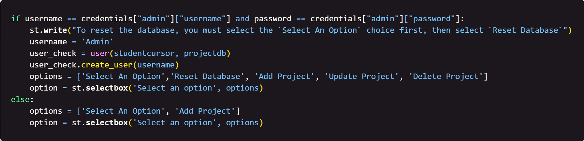

### Week 7 - Beginnings of the Frontend of the Project

#### Table of Contents

- [Home](../README.md)
- [Week 1](../week1/README.md)
- [Week 2](../week2/README.md)
- [Week 3](../week3/README.md)
- [Week 4](../week4/README.md)
- [Week 5](../week5/README.md)
- [Week 6](../week6/README.md)

## Introduction

This week we will begin writing code that will allow us to create the frontend of our project.

#### Focus: Pulling all the files together.

## Instructions

1. Create two new files called `credentials.py` and `project.py`.

2. First, we need to create the credentials dictionary. Write the following code in the `credentials.py` file. Replace the BYU-I email shown with your own email address:

    

    This code will create a dictionary called `credentials` that will hold the users information.

3. Next, Open the `project.py` file. We will code the rest in this file. We need to import the libraries we need. Write the following code: 

    

    This will import all the libraries and files we need to create the frontend of our project.

4. Next, we need to open a connection to the sqlite database. Write the following code:
    
    

    This code will open a connection to the sqlite database and create a cursor object that will allow us to interact with the database.

5. Next, we need to define inputs to enter a username and password. Write the following code:
    
    

    This code will allow the user to enter a username and password.

6. Next, we need to check if the username and password are correct. The `or` statement needs to be on the same line as the `if`:
    
    

    This code will check if the username and password are correct and write a message to the screen.

7. Next, we need to create a variable to hold the current date. Write the following code:
    
    

    This code will create a variable called `current_date` that will hold the current date and write it to the screen.

8. Now we need to create option lists based on the user. Write the following code:
    
    

    This code will create option lists based on the user and write them to the screen.

9. Next, we will write the option to reset the database:

    

    This code will reset the database if the admin user chooses to do so.

10. We will now write the option to add a new project:

    

    This code will allow the user to add a new project to the database.

<!-- create a list of steps under step 11 -->
11. We will now write the option to view the projects:

    * First create a checkbox 

    

    This code will allow the user to update a project in the database.

