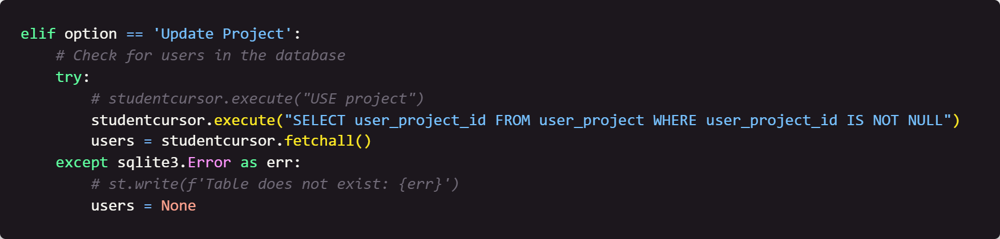
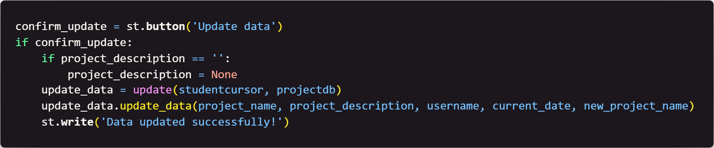

### Week 7 - Beginnings of the Frontend of the Project

#### Table of Contents

- [Home](../README.md)
- [Week 1](../week1/README.md)
- [Week 2](../week2/README.md)
- [Week 3](../week3/README.md)
- [Week 4](../week4/README.md)
- [Week 5](../week5/README.md)
- [Week 6](../week6/README.md)

## Introduction

This week we will continue writing code for our frontend.

#### Focus: Pulling all the files together.

## Instructions

1. Go to the `project.py` file and go to the line right after you wrote `st.write('Data inserted successfully')`. We are going to create two more `elif` statements. The first will be for the user to update the data and the second will be for the user to delete the data. Write the following code:
    
    

    This code will check to see if users exist in order to update the database.

2. Next write the `if` statement to display the projects:
        
    

    This code will display the projects in the database.

3. Next, write some options to allow the user to update the project:

    

    This code will allow the user to update the project.

4. Next, write the handling of the update checkbox:
    
    

    This code will handle the update checkbox.

5. Finally, for the update, write the confirmation code:

    

    This code will confirm the update.

6. Next, write the code to delete the project. Note: The `try` block is the same as the update `try` block:

    

    This code will begin the delete process.

7. Next, write the code to show the projects to delete. Note: This code is simiar to the update code:

    

    This code will show the projects to delete.

8. Next, write the code to handle the delete:

    

    This code will handle the delete.